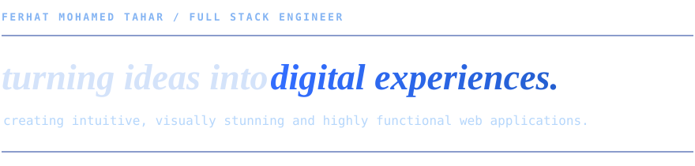

  

 

  
  
  
  

 

### Tools and Languages

 

### About Me

- **Full-Stack Ownership**: 3+ years of experience delivering 20+ production-grade web applications from architecture to live deployment.
- **Frontend & Systems Architecture**: Specializing in **Next.js**, **React.js**, and **TypeScript**, engineering fast, scalable, and responsive user experiences.
- **Backend & API Systems**: Skilled in building high-performance REST APIs, microservices, and serverless backends using **Nest.js**, **Hono**, **Fastify**, **Express.js**, **PostgreSQL**, **TypeORM**, and **MongoDB**.
- **Cyber Security & Zero Trust**: Master's background in **Cyber Security**, engineering applications around **Zero-Trust architecture**, networking fundamentals, identity protection, and defensive web security.
- **Cloud & Continuous Growth**: Active growth in **AWS cloud DevOps**, system design, and high-throughput web architectures.

 

<!-- LeetCode Solved Problems Badge -->

  

 

<!-- GitHub Stats Grid -->

  
  

  

